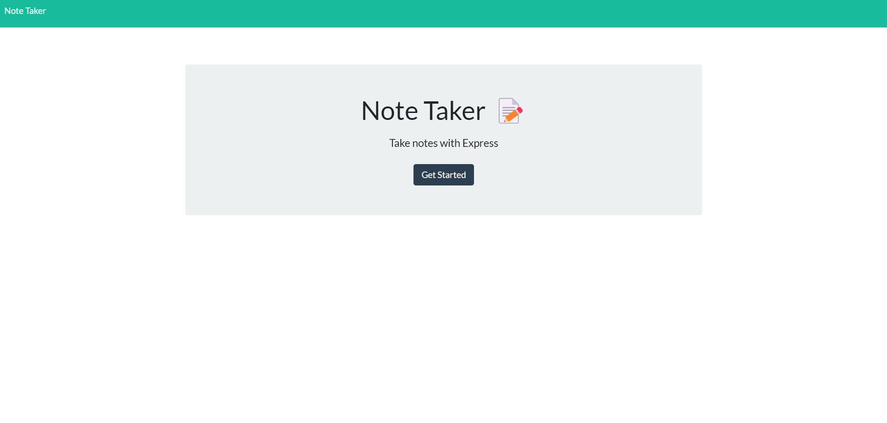
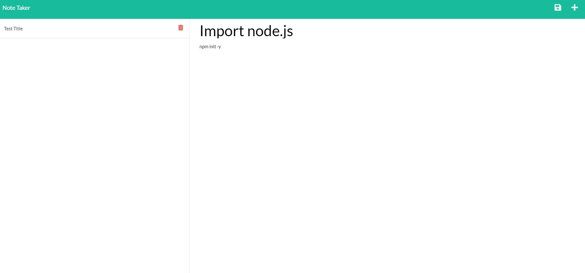

<div align="center">

# Scribbles

</div>


<div align="center">

[](https://opensource.org/licenses/MIT) [](https://nodejs.org/en/)

</div>


I wanted somewhere online to make quick, organised notes to refer too later or when I needed too remember some info but didn't have time that I could access anywhere with an internet connection, that is customized and customzeable. This helps reduce time with all the varying sources of note taking that requires a phone, local machine, or paper! (what's that?).

## Requirements

This application is run completely in the browser.

## Further Developments

### Additional Features

- 1. Later I will be adding a calendar, which will provide standard business hours. This information will be saved and rendered when previous dates are selected

- 2. In addition, color coding, changing existing notes, mark as complete, base importance, and additional UI changes.

## Installation

```
To run this app on the local terminal, run;
git clone {http}
Open in preferred text editor
npm init -y
npm i (install existing dependancies)
```

## Credits

[Origin 42](https://github.com/origin-42): Dave Plummer

## Lisences

## Questions

Direct any questions too;

- [origin-42](https://github.com/origin-42)
- d.plummer89@hotmail.com

## Extras

[Home Page](https://git.heroku.com/scribbles-the--note-taker.git)





